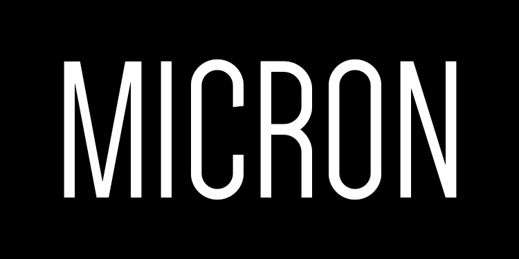
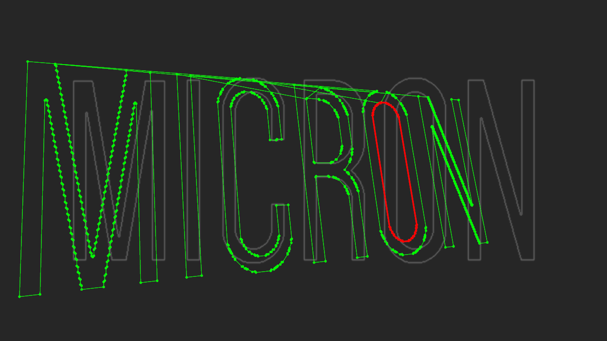

cv.jit.rj.findcontours
# Jitter external to find contours in binary images
### Creates custom 2D shapes starting from a binary raster image

The first outlet outputs the contours as ordered sequence of points organized in a one dimensional 3 planes jitter matrix.
* plane 1: contains x coordinates (based on pixels)
* plane 2: contains y coordinates (based on pixels)
* plane 3: contains the contour index (often the object finds multiple contours in the binary image)

It is also possible to simplify the contours playing with the "epsilon" attribute.

Author: **Rajan Craveri** (micron)
https://www.patreon.com/posts/cv-jit-rj-win-37043276

Build starting point
https://jmpelletier.com/building-your-own-cv-jit-externals/

:heart: Thanks to all my supporters on Patreon

And thanks for helps, tests and suggestions to:
* Jean Marc Pelletier
* Luca Moroni
* Rob Ramirez
* Alberto Barberis
* Federico Nitti

